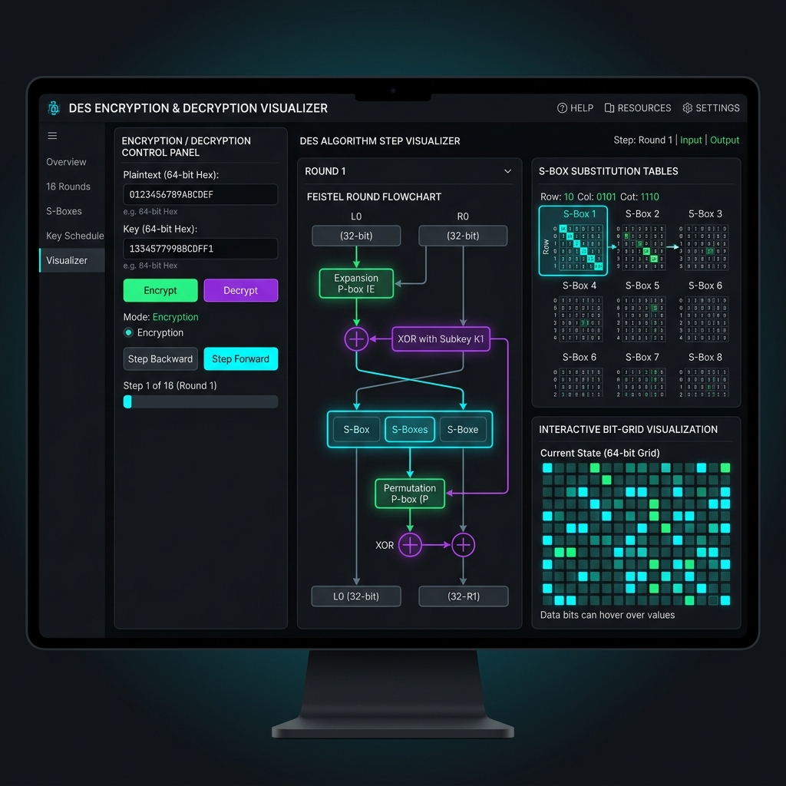

# 🔐 Interactive DES Encryption & Decryption Visualizer

> An interactive, educational web application for exploring and understanding the **Data Encryption Standard (DES)** algorithm — step by step, bit by bit.

🌐 **Live Demo:** [https://ebrahim4070.github.io/Interactive-DES-Visualizer/](https://ebrahim4070.github.io/Interactive-DES-Visualizer/)

[](https://ebrahim4070.github.io/Interactive-DES-Visualizer/)

[](LICENSE)
[](https://developer.mozilla.org/en-US/docs/Web/JavaScript)
[](https://developer.mozilla.org/en-US/docs/Web/HTML)
[](https://developer.mozilla.org/en-US/docs/Web/CSS)

---

## 📸 Visualization Preview



---

## ✨ Features

- **📊 Step-by-Step Algorithm Visualizer**: Step through all **16 Feistel rounds**, Initial Permutation (IP), Expansion Permutation (E), S-Box Substitutions, Permutation (P), and Final Permutation (FP).
- **🎲 S-Box Lookup Breakdown**: Visualize each of the 8 S-Boxes with dynamic row & column index extraction and binary substitution matrix highlights.
- **⊕ Live Color-Coded Bit Grid**: Interactive 64-bit grids showing bit states across rounds:
  - 🟢 **Green**: Bit unchanged
  - 🔴 **Red**: Bit changed/flipped
  - 🟡 **Yellow**: Active bit
  - 🔵 **Blue**: Current operation
- **🔑 Subkey Schedule Tracker**: Shows how a 64-bit key yields 16 unique 48-bit subkeys via Permuted Choice 1 (PC-1), Circular Left Shifts, and Permuted Choice 2 (PC-2).
- **🔒 Encryption & 🔓 Decryption**: Perform real DES encryption/decryption with instant multi-format output in **Hexadecimal**, **Base64**, and **Binary**.
- **⚡ Playback Controls**: Auto-play speed adjustment ($0.5\times$ to $4\times$), jump to specific round, replay, and keyboard shortcuts support ($\leftarrow$, $\rightarrow$, $\text{Space}$, $\text{R}$).
- **📜 History & Export**: Keep track of encryption operations with search and export capabilities to JSON/CSV.
- **🌓 Theme & Responsive Design**: Seamless Dark & Light themes with glassmorphism UI built for all screen sizes.

---

## 🔄 DES Pipeline Overview

```text
       ┌────────────────────────┐
       │   Plaintext (64-bit)   │
       └───────────┬────────────┘
                   ▼
       ┌────────────────────────┐
       │ Initial Permutation IP │
       └───────────┬────────────┘
                   ▼
         ┌──────────────────┐
         │ Split: L₀ │ R₀   │
         └─────────┬────────┘
                   ▼
     ┌──────────────────────────┐     ┌────────────────────────┐
     │   Feistel Round 1..16    │ ◄───┤ Subkey Kᵢ (48-bit)     │
     │  Li = Rᵢ₋₁               │     │ (PC-1 ➔ Shift ➔ PC-2)  │
     │  Ri = Lᵢ₋₁ ⊕ f(Rᵢ₋₁, Kᵢ) │     └────────────────────────┘
     └───────────┬──────────────┘
                 ▼
         ┌──────────────────┐
         │  Swap: R₁₆ │ L₁₆ │
         └─────────┬────────┘
                   ▼
       ┌────────────────────────┐
       │ Final Permutation (FP) │
       └───────────┬────────────┘
                   ▼
       ┌────────────────────────┐
       │  Ciphertext (64-bit)   │
       └────────────────────────┘
```

---

## 🚀 Getting Started

Since this is a client-side Vanilla JavaScript web application, no build tools or package managers are required!

### Option 1: Open Directly
Simply open `index.html` in any modern browser (Chrome, Firefox, Edge, Safari).

### Option 2: Run via Local HTTP Server
```bash
# Using Python
python -m http.server 8000

# Using Node.js npx
npx serve .
```
Then navigate to `http://localhost:8000` in your web browser.

---

## ⌨️ Keyboard Shortcuts

| Key | Action |
| --- | --- |
| `←` | Previous step in visualizer |
| `→` | Next step in visualizer |
| `Space` | Play / Pause visualization |
| `R` | Reset visualizer to step 1 |

---

## 📂 Project Structure

```text
Interactive-DES-Visualizer/
├── assets/
│   └── preview.png          # Visualizer preview screenshot
├── css/
│   ├── animations.css       # Micro-animations & keyframes
│   ├── base.css             # Base resets & typography
│   ├── components.css       # Buttons, modals, cards, tabs
│   ├── layout.css           # Grid & flex layouts
│   ├── themes.css           # Dark & Light theme tokens
│   ├── variables.css        # CSS variables & color system
│   └── visualizer.css       # Visualizer component styles
├── js/
│   ├── des/
│   │   ├── core.js          # DES encryption & decryption core logic
│   │   ├── tables.js        # Permutation tables & S-Box matrices
│   │   └── visualizer.js    # Step generator engine
│   ├── ui/
│   │   ├── bitGrid.js       # Interactive bit grid renderer
│   │   ├── decrypt.js       # Decryption section controller
│   │   ├── encrypt.js       # Encryption section controller
│   │   ├── flowchart.js     # DES pipeline flowchart diagram
│   │   ├── roundTrack.js    # Round progress indicator
│   │   ├── stepPlayer.js    # Visualization playback player
│   │   └── toast.js         # Toast notification system
│   ├── utils/
│   │   ├── fileHandler.js   # File upload & download utilities
│   │   ├── format.js        # Hex, Base64 & Binary converters
│   │   └── history.js       # History storage & export
│   ├── about.js             # Cryptography educational content
│   └── main.js              # Application entry point & router
├── index.html               # Main application template
└── README.md                # Project documentation
```

---

## 📖 Educational Resources & Standard Specification

The Data Encryption Standard is specified in **FIPS PUB 46-3**. For modern security applications, DES has been superseded by **AES (Advanced Encryption Standard, FIPS 197)** due to DES's 56-bit key length. This project is built solely for **educational purposes** to help students visualize symmetric-key block cipher concepts.

---

## 📜 License

Distributed under the **MIT License**. See `LICENSE` for details.

Developed with ❤️ by [ebrahim4070](https://github.com/ebrahim4070).
